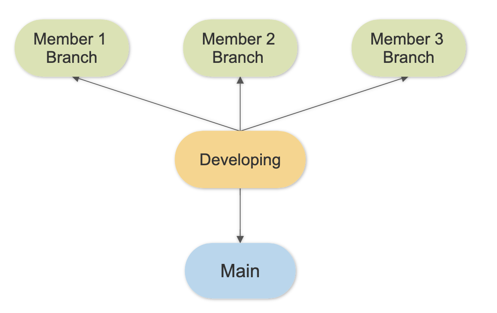

<h2>Getting Started</h2>

Start on this project by forking and cloning this project repository to get a local copy of the dataset.

<h2>Repository Structure</h2>

For this project we will require the following directory structure. All individual work should be done within your personal "member" folder.

<pre>project-folder     |     README.md     data-folder     images-folder     notebooks-folder           |           report.ipynb           exploratory-folder                   |                   member-1-notebooks-folder                   member-2-notebooks-folder                    member-3-notebooks-folder                      </pre>
<h2>Github Workflow</h2>

For this project, we ask that you use the following github workflow.

&nbsp;

Each team member should have their own "member branch", where the vast majority of their work takes place.

At the end of each day, or on an agreed upon cadence within your group, each team member will sync their member branches by merging with the developing branch. All work that ends up in the&nbsp;<em>main</em> branch should be finalize first on developing.&nbsp;

This can be done by running the following in command line:

<ul>
    <li>
        <pre>git checkout developing</pre>
    </li>
    <li>
        <pre>git merge &lt;name of member branch&gt;</pre>
    </li>
    <li>
        <pre>git push origin developing</pre>
    </li>
</ul>

<strong>Please note:</strong>

<ul>
    <li>If a team member has pushed to developing, and you have not pulled those changes down, then before you push you will need to run a git pull.</li>
    <li>If you and your teammate made edits to the same file, it is possible that you could end up with a merge conflict. That is not the end of the world! Let an instructor know and we'll walk you through the process.</li>
</ul>
